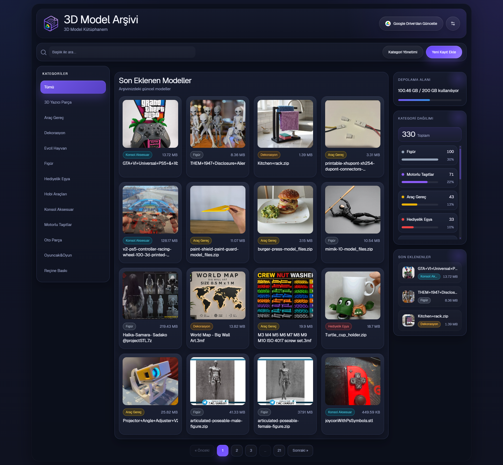
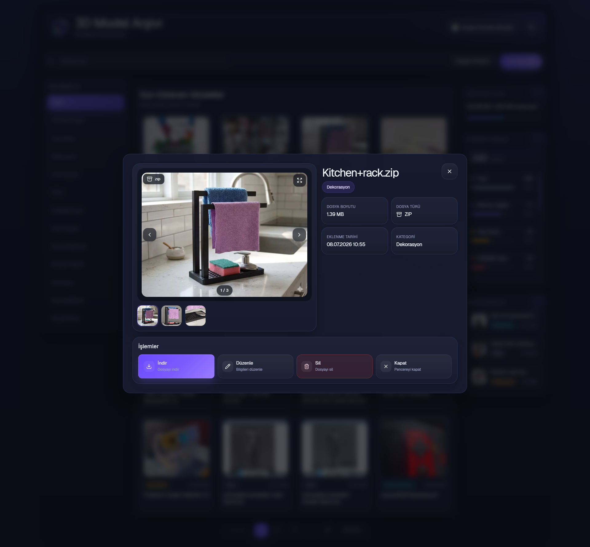
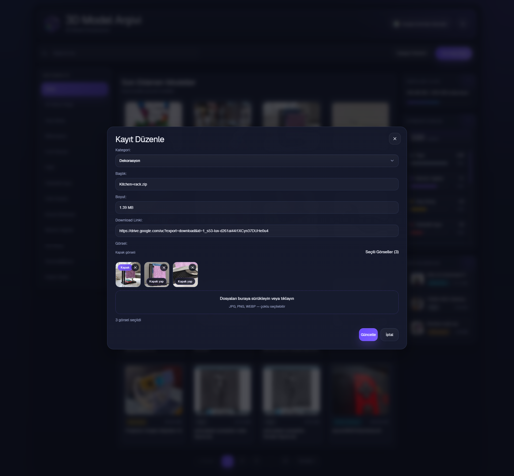
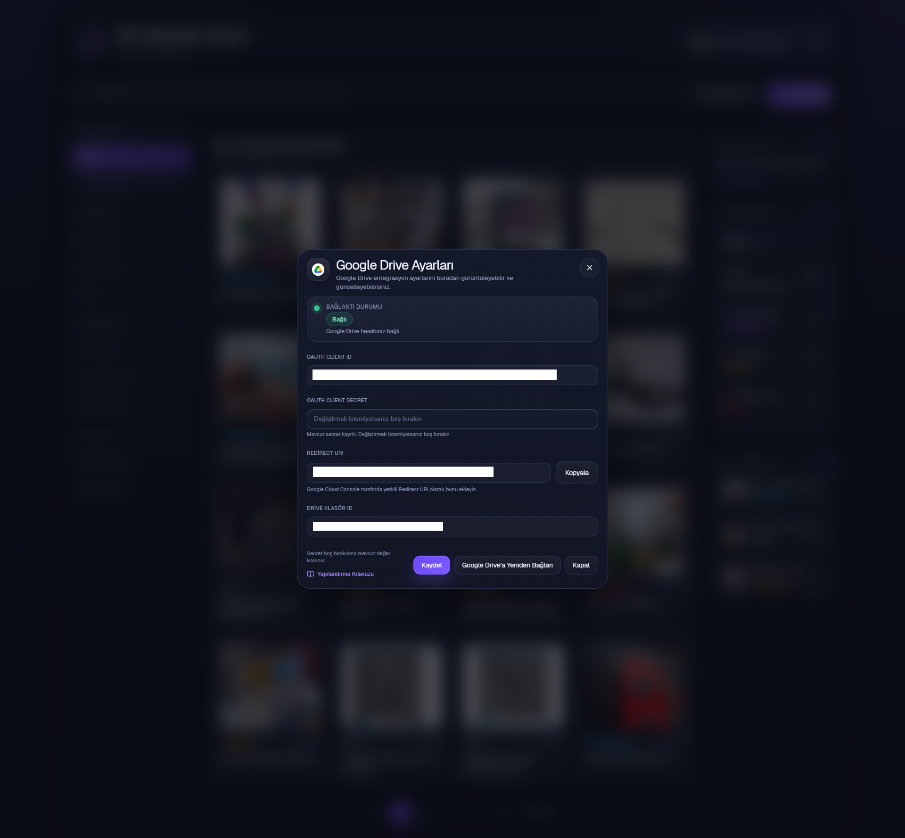
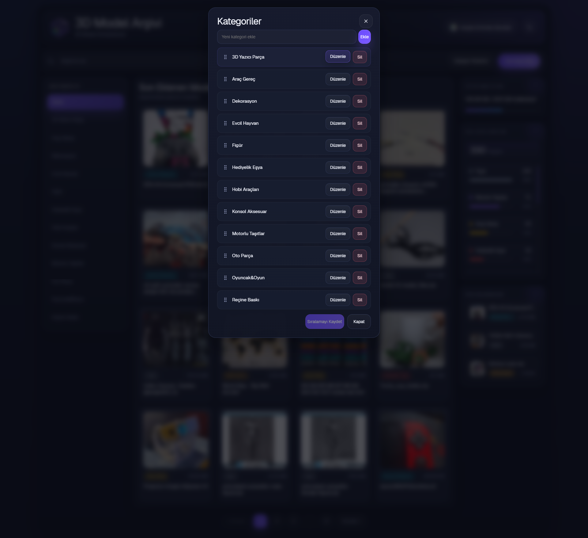
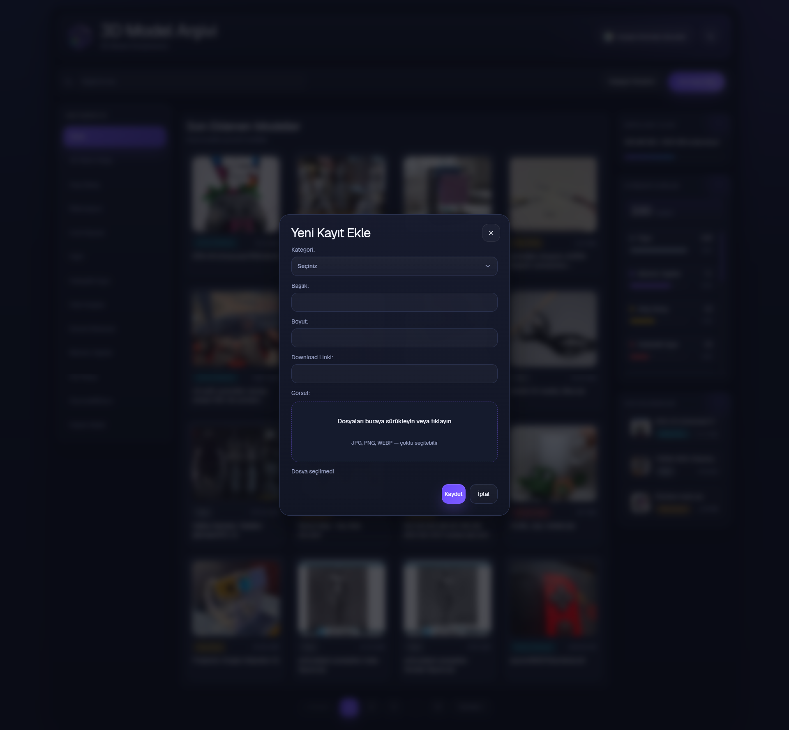

# 3D Model Arşivi

### Free & Open Source STL Archive Manager

A modern web application for organizing, browsing and managing STL and other 3D model files with optional Google Drive synchronization.

Perfect for makers who want a clean, searchable and visual library for their growing STL collection.



---

## Why?

As my personal STL collection grew, finding the right model in Google Drive became increasingly difficult.

I wanted a fast, visual and easy-to-use archive where I could browse models with preview images, organize them into categories and keep everything synchronized with Google Drive.

This project was created to solve that problem and is released completely free and open source for anyone who might find it useful.

---

## Features

- 🖼️ Visual gallery with image previews
- 📁 Category management
- 🔎 Instant search
- ☁️ Optional Google Drive synchronization
- 🖼️ Multiple images for each model
- ⭐ Cover image selection
- ↕️ Drag & Drop image ordering
- 📊 Storage usage information
- 🌙 Modern dark interface
- 💾 Self-hosted
- 🆓 Free & Open Source

---

## Screenshots

### Home

Browse your STL collection with categories, search, statistics and storage information.


---

### Model Details

View model information, preview images and download files.



---

### Edit Model

Manage multiple images, choose a cover image and edit model details.



---

### Google Drive Integration

Configure Google Drive OAuth and synchronize your archive directly from Drive.



---

### Category Management

Create, edit and organize model categories.



---

### Add New Model

Add new models with multiple preview images and file information.



---

## 🌐 Localization

The application uses language files located in the `lang/` directory.

All interface texts are stored in `lang/tr.php`, making it easy to translate the application into another language without modifying the source code.

### Default language

- 🇹🇷 Turkish (`lang/tr.php`)

### Translating the application

The current version supports a single language file.

To use another language, simply translate the text values inside `lang/tr.php` and keep the file name unchanged.

No source code modifications are required.

## Requirements

- PHP 8.0 or newer
- MySQL or MariaDB
- Apache, Nginx, WAMP or XAMPP
- Composer
- Google API PHP Client
- Write permission for the `upload/` directory

---

## Installation

### 1. Download the project

Download or clone the repository into your web server directory.

Example for WAMP:

```text
C:\wamp64\www\stl_archive
```

Or clone it using Git:

```bash
git clone https://github.com/arslanfth/stl_archive.git
```

### 2. Install Composer dependencies

Open a terminal in the project directory and run:

```bash
composer install
```

The `vendor/` directory must exist before running the application.

### 3. Start the installer

Open the following address in your browser:

```text
http://localhost/stl_archive/install.php
```

Enter your database information:

- Database host
- Database port
- Database name
- Database username
- Database password

You can enable the option to create the database automatically if it does not already exist.

Google Drive settings are optional during installation and can be configured later.

### 4. Complete the installation

After the installation is completed:

- `includes/db.php` is created automatically
- `install.lock` is created
- The installation page is disabled
- Default database tables and categories are created

The `upload/` directory is empty in the distributed package. Uploaded preview images will be stored in this directory.

---

## Google Drive Integration

Google Drive integration is optional.

The application uses OAuth credentials entered through the settings panel. It does not require manually uploading `credentials.json` or `token.json` files.

### Configuration

1. Open the application settings.
2. Go to the **Google Drive Integration** section.
3. Enter the following information:

   - OAuth Client ID
   - OAuth Client Secret
   - Redirect URI
   - Google Drive Folder ID

4. Save the settings.
5. Click **Connect to Google Drive**.
6. Complete the Google authorization process.
7. Confirm that the connection status is shown as **Connected**.
8. Return to the home page and use **Update from Google Drive**.

---

## Creating Google OAuth Credentials

1. Open Google Cloud Console.
2. Create a new project or select an existing project.
3. Enable the Google Drive API.
4. Configure the OAuth consent screen.
5. Create an OAuth Client ID.
6. Select **Web application** as the application type.
7. Add the Redirect URI displayed in the application settings to the **Authorized redirect URIs** list.
8. Copy the Client ID and Client Secret into the application settings.

The Redirect URI must match exactly, including:

- Protocol
- Domain
- Port
- Folder path

---

## Finding the Google Drive Folder ID

A Google Drive folder URL usually looks like this:

```text
https://drive.google.com/drive/folders/XXXXXXXXXXXXXXXXXXXX
```

The value after `/folders/` is the folder ID.

Example:

```text
https://drive.google.com/drive/folders/1AbCdEfGhIjKlMnOpQrStUv
```

Folder ID:

```text
1AbCdEfGhIjKlMnOpQrStUv
```

---

## Security Notes

- `includes/db.php` contains database connection information and must not be shared.
- `install.lock` prevents the installer from being opened again.
- Sensitive local files are excluded through `.gitignore`.
- Google OAuth information is stored in the database.
- `credentials.json` and `token.json` are not used.
- Do not commit personal database credentials or OAuth secrets to GitHub.

---

## Troubleshooting

### `install.php` does not open

- Confirm that the project is inside the correct web server directory.
- Make sure PHP and your web server are running.
- Check that the project directory is accessible through the browser.

### Database connection error

- Verify the host, port, database name, username and password.
- Make sure MySQL or MariaDB is running.
- Confirm that the database user has permission to connect or create databases.

### Upload directory permission error

- Confirm that the `upload/` directory exists.
- Make sure the web server has write permission for this directory.

### `vendor/autoload.php` not found

Composer dependencies are missing.

Run:

```bash
composer install
```

### `redirect_uri_mismatch`

The Redirect URI in Google Cloud Console must be exactly the same as the Redirect URI shown in the application.

Check the protocol, domain, port and folder path.

### Google Drive is not connected

- Confirm that the Google Drive settings have been saved.
- Complete the Google authorization process.
- Reconnect the account if the status is not shown as **Connected**.

### Google Drive synchronization does not find files

- Verify the Google Drive Folder ID.
- Confirm that the connected Google account has access to the folder.
- Make sure the Google Drive API is enabled in Google Cloud Console.

---

## Project Structure

Important project files:

```text
install.php
schema.sql
composer.json
includes/db.example.php
upload/
screenshots/
```

- `install.php` runs the installation process.
- `schema.sql` contains the database structure and default categories.
- `includes/db.example.php` is an example database configuration file.
- `upload/` stores uploaded preview images.
- `screenshots/` contains the images used in this README.

---

## Technology

- PHP
- MySQL / MariaDB
- JavaScript
- HTML
- CSS
- Google Drive API
- Google OAuth 2.0

---

## Contributing

Contributions, bug reports and feature suggestions are welcome.

You can contribute by:

1. Forking the repository
2. Creating a new branch
3. Making your changes
4. Opening a pull request

For bugs or suggestions, you can open an issue on GitHub.

---

## License

This project is free and open source.

License information will be added in the `LICENSE` file.
